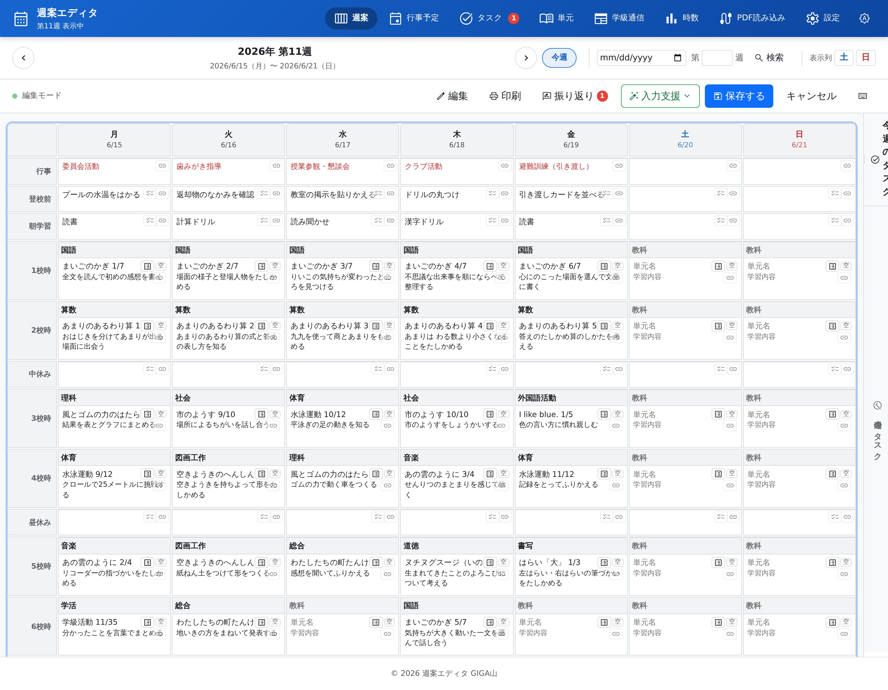
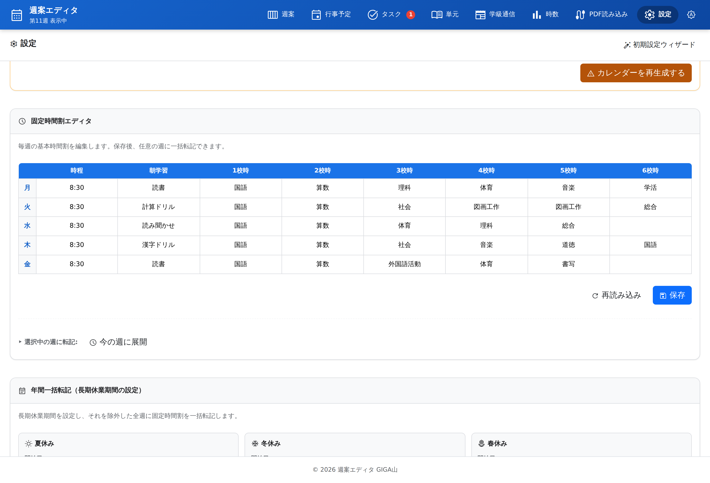
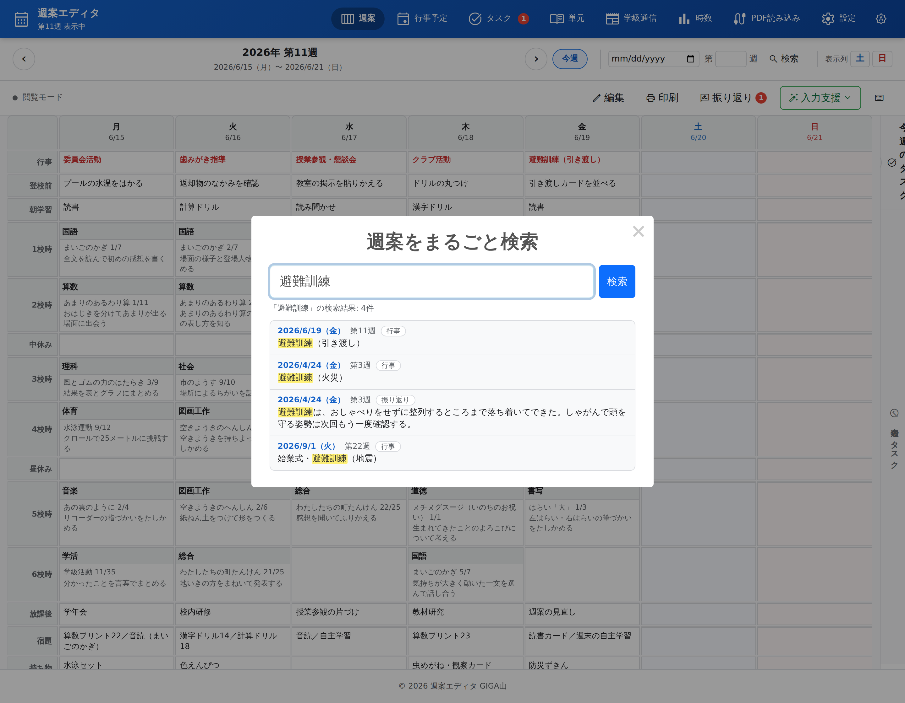
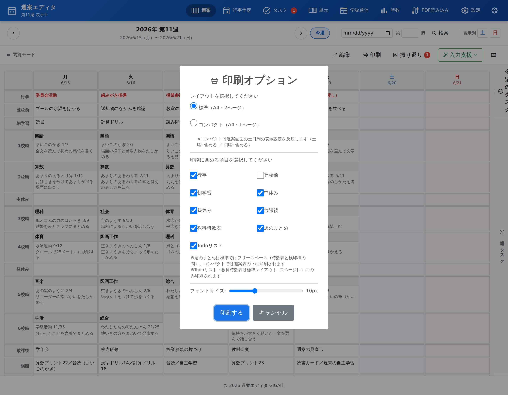
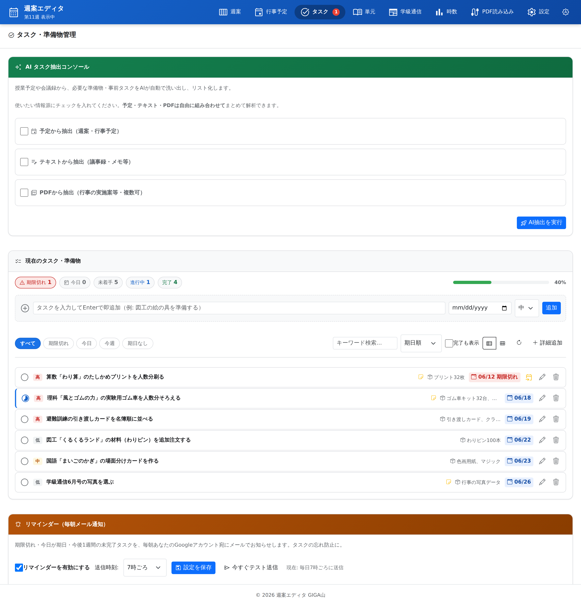
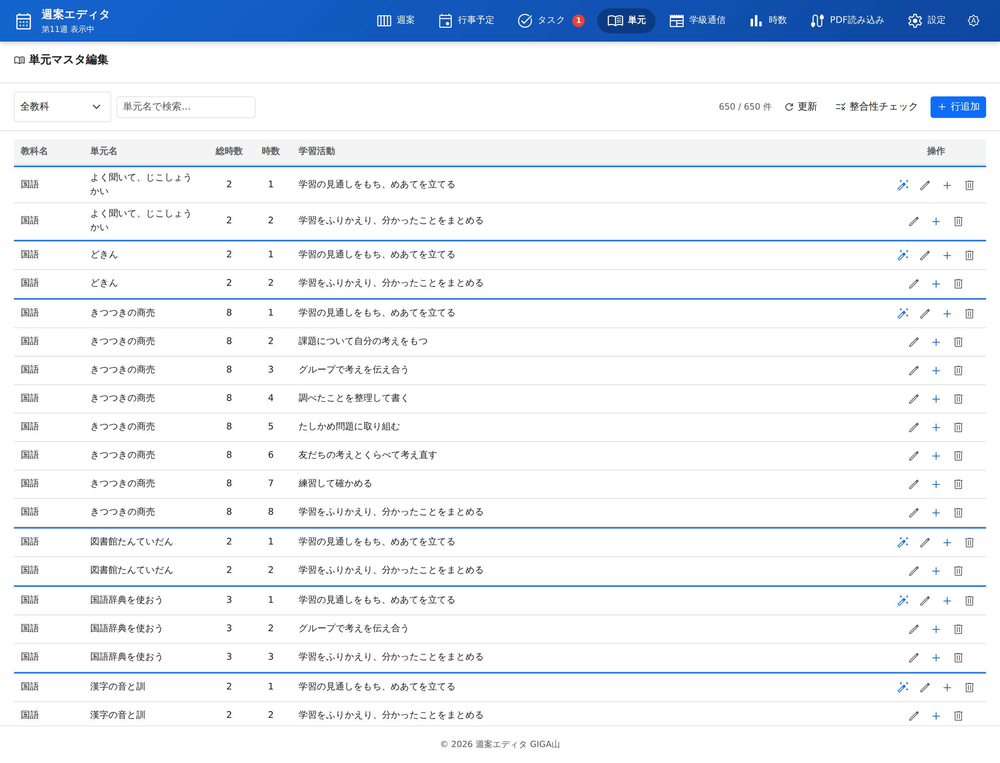
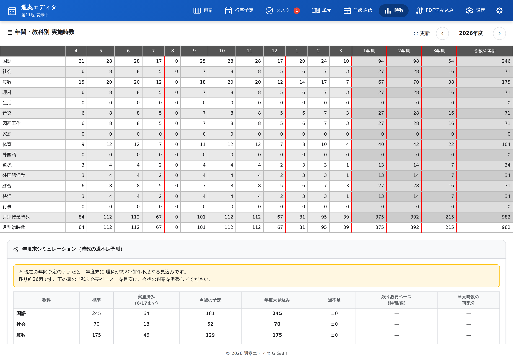
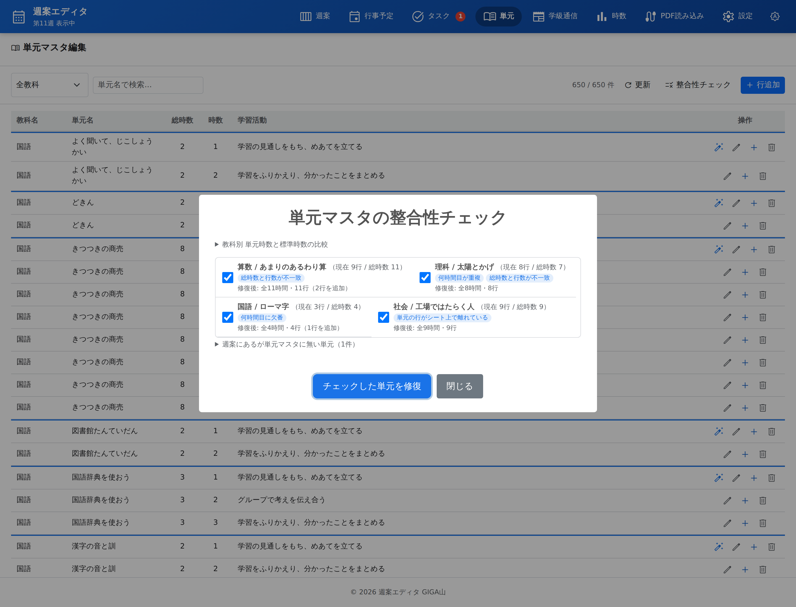
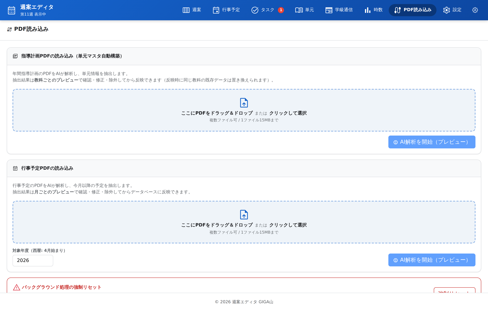
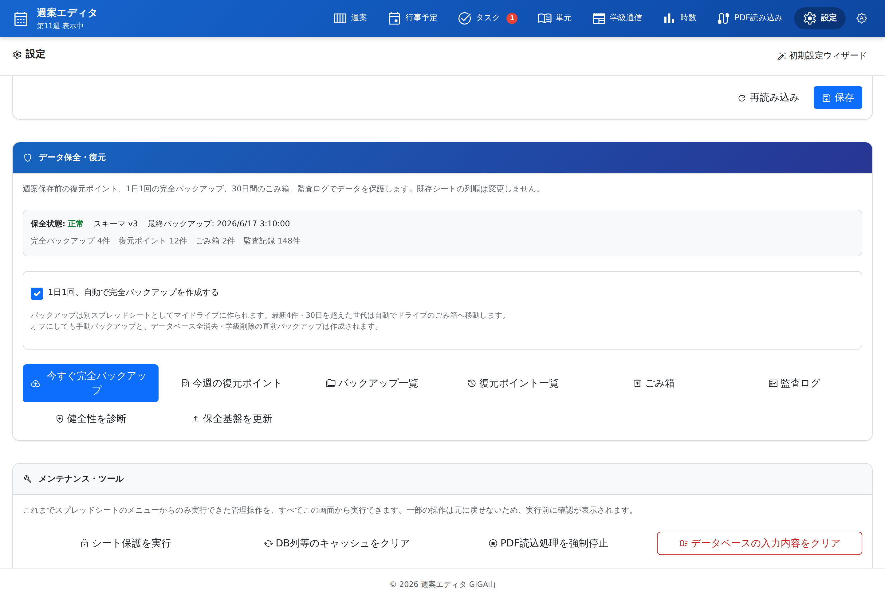

# 週案エディタ の使い方

## はじめに

### このマニュアルについて

このマニュアルは、週案作成支援アプリ「週案エディタ」の使い方を説明するものです。

主に小学校の先生方を対象としており、パソコンの基本的な操作（クリック、文字入力など）ができれば、スプレッドシートやプログラミングの特別な知識がなくてもお使いいただけます。

読みたいところから読んでいただけます。初めてお使いになる場合は、「使いはじめる前の準備」から順にお読みください。

### 週案エディタでできること

週案エディタは、週案（週間指導計画）づくり・授業の振り返り・授業時数の管理・準備物やタスクの管理・学級通信づくりを、ひとつにまとめたアプリです。ブラウザだけで動き、費用はかかりません。

日々の授業準備にかかる時間を短縮し、先生方がより教育活動に集中できるようお手伝いします。

記録は先生ご自身の Google スプレッドシートに保存されます。子どもの名前や成績を集める仕組みはありません。

使うのは学級担任の先生です。子どもが直接開くことは想定していません。

### 使いはじめる前に用意するもの

お手元に次のものがあるかご確認ください。

- インターネットに接続されたパソコンかタブレット
- Google アカウント（学校で配られたアカウント）
- Web ブラウザ（Google Chrome または Microsoft Edge を推奨します）
- 学校から配られた、週案エディタの URL

「Gemini APIキー」は、AI の機能（単元の自動入力・学級通信の下書き・タスクの抽出）を使うときにだけ必要です。後からでも設定できますので、最初は無くても構いません。

## 使いはじめる前の準備（初回のみ）

ここは、初めてお使いになるときに一度だけ行う作業です。二度目からは必要ありません。

### アプリを開いてログインする

1. パソコンかタブレットで、学校から配られた URL を開いてください。
2. Google アカウント（学校で配られたアカウント）でログインしてください。

画面が真っ白なまま進まないときは、ログインが済んでいない可能性があります。「こまったとき」の「画面が真っ白のまま、または読み込み中から進まない」をご覧ください。

### 【重要】初めてのときに出る「許可」の画面について

週案エディタは、先生ご自身の Google スプレッドシートに週案を保存します。そのため、初めてお使いになるときに、Google から「このアプリにアクセスを許可しますか」という確認の画面が表示されます。

見慣れない画面が出て不安に思われるかもしれませんが、これは先生の代わりにスプレッドシートを操作する許可を求めているもので、正常な動作です。

求められる許可は、週案を保存するスプレッドシートの読み書き、Google ドライブ内のファイルの選択、そして Classroom への投稿（連携を使う場合のみ）です。写真や他の書類を勝手に見ることはありません。

1. 「続行」または「許可」と書かれたボタンを押してください。
2. アカウントを選ぶ画面が出たら、ご自身の Google アカウントを選んでください。
3. 許可を求める内容を確認し、いちばん下の「許可」を押してください。

もし画面の途中で「このアプリは Google で確認されていません」という警告が出た場合は、「詳細」を押し、続けて表示されるリンクを押すと先に進めます。これは、学校や個人が作成したプログラムに対して Google が標準的に出す警告で、危険を知らせているものではありません。

この許可の作業は、初回に一度だけ必要です。許可の画面を閉じてしまった場合は、もう一度アプリを開き直すと再び表示されます。

### 初期設定ウィザードで 4 つを決める

ログインが済むと「はじめる →」というボタンが表示されます。押すと、次の 4 つを順に決める画面が出ます。

1. 担当学年: 時数集計の基準になります。選んだ学年に応じた標準時数が自動で入ります。
2. Gemini APIキー: AI の機能を使うときにだけ必要です。空欄のまま進んでも構いません。
3. Classroom 連携: 使わない場合は飛ばして構いません。
4. 年間カレンダー: 年度と、開始する月曜日を選びます。週案の日付のもとになります。

最後にまとめて保存されます。

「担当学年」は必ず選んでください。ここで選んだ学年が、時数の集計と、年度末の見込みの計算の基準になります。

「Gemini APIキー」を設定される場合は、課金を有効にした有料ティアのキーをお使いください。無料のキーでは、送った内容が Google の AI の学習に使われることがあります。

設定は後から「設定」タブでいつでも変えられます。この画面をもう一度出したいときは、「設定」タブの「初期設定ウィザード」を押してください。

### パソコンやタブレットにアプリとして入れておく

ブラウザのタブから探さなくてよくなり、起動も速くなります。必須ではありませんが、毎日お使いになるならおすすめします。

Chromebook と Windows の Chrome / Edge をお使いの場合は、次のようにします。

1. 画面の左下にある丸い歯車のボタンを押してください。
2. 「アプリとしてインストール」を押してください。

アドレスバーの右端に出るインストールのアイコンからでも同じことができます。

歯車のボタンが見当たらないときは、開いている URL が `script.google.com` で始まっていないかご確認ください。このボタンは `schoolplan-editor.giga-school.com` の入口ページから開いたときにだけ表示されます。

iPad と iPhone の Safari をお使いの場合は、先に URL を確かめてから追加してください。

1. アドレスバーが `schoolplan-editor.giga-school.com` になっているか確かめてください。
2. `script.google.com` になっているときは、画面の上に出る「入口ページを開く」を押して戻ってください。
3. 画面の下（または上）にある共有ボタンを押してください。
4. 「ホーム画面に追加」を選んでください。
5. 右上の「追加」を押してください。

先に URL を確かめるのは、Safari の「ホーム画面に追加」が、いま開いているページをそのまま登録するためです。しかも必ず成功してしまうので、間違ったページを追加してもその場ではエラーが出ません。気づくのは、後でアイコンを押したときになります。

## 画面の見かた

最初に開く画面と、各部の名前をご説明します。


最初に開くのが「週案」の画面です。1 週間ぶんの予定が表になって表示されます。

### 画面の上に並ぶ 8 つのタブ

画面のいちばん上に、8 つのタブが並んでいます。押すと表示が切り替わります。

- 「週案」は、1 週間の予定を書くところです。最初に開く画面です。
- 「行事予定」は、学校の年間行事予定 PDF を登録して、その場で見るところです。
- 「タスク」は、準備物や連絡事項を管理するところです。残っている数がタブに表示されます。
- 「単元」は、単元マスタ（年間指導計画）を表で編集するところです。
- 「学級通信」は、学級通信をつくるところです。
- 「時数」は、教科ごとの授業時数と、年度末の見込みを確かめるところです。
- 「PDF読み込み」は、指導計画や行事予定の PDF を AI に読み取らせるところです。
- 「設定」は、学年・APIキー・固定時間割・データ保全などを決めるところです。

いちばん右にある明るさのアイコンを押すと、画面の見た目が「自動（端末の設定に合わせる）」「明るい」「暗い」の順に切り替わります。

### 週案の表は 14 行でできている

週案の表は、上から順に次の 14 行です。

行事、登校前、朝学習、1校時、2校時、中休み、3校時、4校時、昼休み、5校時、6校時、放課後、宿題、持ち物。

各校時は「教科」「単元」「学習活動」の 3 つに分かれています。土曜と日曜の列は、表示するかどうかを選べます。

祝日は自動で赤く色分けされ、「海の日」のように祝日名も表示されます。

### 表の右にあるパネル

表の右側に、開いたり閉じたりできるパネルがあります。上のタブで「タスク」と「行事予定」を切り替えられます。切り替えた側は、次に開いたときも残ります。

## 週案を書く

ここが週案エディタの中心になる画面です。

### 閲覧モードと編集モードを切り替える

週案の画面には、読むだけの「閲覧モード」と、書き替えられる「編集モード」があります。うっかり触って消してしまうことを防ぐため、初めは閲覧モードで開きます。

編集モードにする方法は 3 つあります。どれを使っても同じです。

- 書き替えたいセルをダブルクリック（タブレットではダブルタップ）する
- 画面上部の「編集」ボタンを押す
- キーボードの `E` キーを押す



編集モードになると、画面上部の表示が「編集モード」に変わります。

### セルに予定を入力する

1. 編集モードにしてください。
2. 書き替えたいセルを選び、教科・単元・学習活動を入力してください。
3. 「閲覧モード／編集モード」の右に表示される保存の状態をご確認ください。

「保存中...」と出ているあいだは、まだ書き込みの途中です。「保存しました」に変われば完了です。タブを切り替えたときなどに走る自動保存も、ここに表示されます。

1 つのセルに複数の情報を書きたいときは、キーボードの `Alt` キーを押しながら `Enter` キーを押すと、セルの中で改行できます。

### 1 コマを 2 教科で分け合うときの書き方

1 コマを 2 つ以上の教科で分け合ったときは、教科の欄に次のように、それぞれの教科へ分数を付けて書いてください。

```
国語2/3 行事1/3
```

分数の合計は必ず 1 にしてください。この形式で入力しないと、時数が正しく計算されません。

分け合ったコマでは、単元の選択・単元の自動入力・学習活動の取得は、分数の大きいほう（単元マスタに登録がある教科）の単元マスタを見にいきます。

### コマをコピーする、消す、元に戻す

いずれも編集モードのあいだだけ行えます。

1. コピーしたいコマを選んでください。
2. `Ctrl+C` を押してください。
3. 貼りたいコマへ移ってください。
4. `Ctrl+V` を押してください。

右クリックのメニューからも同じことができます。タブレットでは、選んでいるセルの右上に表示される「⋮」を押してください。

コマの中身を消すときは `Delete` を押すか、メニューの「このコマをクリア」を選んでください。直前の操作を取り消したいときは、メニューの「元に戻す」を選んでください。

キーボードでできることの一覧は、画面の右上にあるキーボードのアイコンから見られます。

### 前の週・次の週へ移動する

画面の上にある「‹」「›」で移動できます。「今週」を押すと今の週に戻ります。

## 入力の手間を減らす

毎週おなじことを打ち直さずに済ませるための機能です。「週案」タブの「入力支援」から使います。


「入力支援」を押すと、このメニューが開きます。

### あらかじめ固定時間割を登録しておく

まとめて転記するには、先に基本の時間割を登録しておく必要があります。登録は「設定」タブで行います。



月曜から金曜までの、基本の時間割を入れます。

1. 「設定」タブを開いてください。
2. 「固定時間割」の欄を開いてください。
3. 曜日ごとに、各校時の教科を入れてください。
4. 「保存」を押してください。

【！】覚えておいていただきたいこと:

- ここで保存したものだけが、次の「固定時間割反映」で転記されます。保存を忘れると、転記しても何も入りません。
- 途中で時間割が変わったときは、ここを直してから転記し直してください。すでに書いた週が自動で書き替わることはありません。

### 固定時間割をまとめて転記する

転記は「週案」タブの「入力支援」から行います。

1. 「入力支援」を押してください。
2. 「固定時間割反映」を選んでください。
3. 実際に入る時間割が表で表示されますので、確かめてください。
4. よろしければ実行してください。

【！】覚えておいていただきたいこと:

- 3 で表示される表は、実行前の確認です。ここで気づけば、まだ何も書き替わっていません。
- 「設定」タブでの保存し忘れがあるときは警告が表示され、その場で保存できます。
- すでに書いてある週へ転記すると、その内容は固定時間割で上書きされます。書き替えたくない週がある場合は、その週を外してから実行してください。

### 単元を選ぶ

教科のセルから単元を選ぶと、その単元をどこまで指導したかが一緒に表示されます。あと何時間残っているかを見ながら決められます。


単元の右に、指導の進み具合が出ます。

AI にまかせることもできます。「入力支援」から「単元自動入力」を選ぶとその週が、「以降を一括自動入力」を選ぶと先の週までまとめて入ります。予定を前後の時間にずらしたいときは、「入力支援」の「単元をずらす」をお使いください。

【！】覚えておいていただきたいこと:

- ここに出てくる単元は、「単元」タブの単元マスタに登録したものです。出てこない教科は、まだ登録されていません（「単元と授業時数を管理する」をご覧ください）。
- 自動入力も、入ったあとで手で直せます。AI が決めたまま動かせなくなることはありません。

### 前に書いたことを言葉で探す

すべての週から、書いた言葉で探せます。昨年の同じ時期に何をしたかを調べるときにお使いいただけます。



1. 「週案」タブの「検索」を押してください。
2. 探したい言葉を入力してください。

## 週案を印刷して配る

印刷は「週案」タブから行います。A4 の用紙に合わせて自動で整えられます。

### 印刷オプションを選ぶ

印刷の設定は、押してすぐ紙に出るのではなく、いったんこの画面で決めます。



レイアウトと、含める項目をここで選びます。

印刷の手順:

1. 週案の画面で「印刷」を押してください。
2. レイアウトを「標準（A4・2ページ）」か「コンパクト（A4・1ページ）」から選んでください。
3. 含める項目を選んでください。行事・登校前・朝学習・中休み・昼休み・放課後・教科時数表・週のまとめ・Todoリストを、それぞれ入れたり外したりできます。
4. 印刷プレビューが表示されたら、用紙が A4、向きが縦になっているか確かめてください。

「用紙に合わせて文字サイズを自動調整」は、はじめから ON になっています。その週の分量に合わせて、A4 に収まる範囲でいちばん大きい文字サイズが自動で選ばれます。OFF にすると、8 から 14px のあいだでご自身で決められます。

こちらが、標準レイアウトで印刷したときの 1 ページ目です。


紙に出したときの見え方です。

【！】覚えておいていただきたいこと:

- 選んだ内容は次回も記憶されます。毎週選び直す必要はありません。
- Todoリストと教科時数表は、「標準」レイアウトの 2 ページ目にだけ印刷されます。コンパクトを選ぶと出ません。
- 週案の内容が紙に出るだけで、記録が書き替わることはありません。印刷を試して困ることはありません。

### 【！】色を付けて印刷したいとき

曜日の色分けを紙にも出したい場合は、印刷プレビューの「詳細設定」を開き、「背景のグラフィック」にチェックを入れてください。

チェックを入れないと、画面では色が付いていても、印刷すると色が出ません。「印刷したら白黒になった」というときは、たいていここです。

なお、この設定はブラウザ側の設定です。週案エディタではなく、お使いのブラウザの印刷画面にあります。

## その日の授業を振り返る

一日の終わりに、その日の授業を短く記録する機能です。

### 15 時を過ぎると自動で開く

15 時を過ぎてからアプリを開くと、その日の振り返りが自動で立ち上がります。授業を入力した日で、まだ書いていない場合だけです。

書いた振り返りは、この一覧にたまっていきます。「振り返り」ボタンからいつでも開けます。


入力は、質問に順に答えていく形です。


1. 予定との変更点、成果、課題、特記事項の質問に答えてください。
2. その場で書けないときは「あとで書く」を選んでください。

【！】覚えておいていただきたいこと:

- 「あとで書く」で保留したものは消えません。「振り返り」ボタンの一覧から後で書けます。
- 自動で開くのは、その日に授業を入力していて、まだ振り返りを書いていないときだけです。開かないからといって、故障ではありません。
- 自動で開いてほしくないときは、そのまま閉じていただいて構いません。書かないままでも、ほかの機能はふつうにお使いいただけます。

### 音声入力で書く

キーボードで打つ代わりに、話した内容をそのまま文字にできます。

各入力欄の「音声入力」ボタンを押してから、お話しください（Chrome や Edge などでお使いいただけます）。

【！】覚えておいていただきたいこと:

- 話した音声は、ブラウザが音声認識サービスへ送って文字にします。振り返りには子どもの名前や様子が入ることがありますので、気になるときはキーボードで入力してください。
- ボタンを押さなければ、音声が送られることはありません。押していないあいだにマイクが働くことはありません。

### 週のまとめが自動で作られる

その週の授業がある日すべての振り返りが終わると、AI が「週のまとめ」を作り、同じ週の日曜日の欄に保存します。

印刷の「含める項目」で「週のまとめ」を選ぶと、週案と一緒に紙に出せます。

【！】覚えておいていただきたいこと:

- まとめが作られるのは、その週の授業がある日すべての振り返りが済んだときです。1 日でも空いていると作られません。
- できたまとめは、ふつうの文章として直せます。そのままにしておく必要はありません。

## 準備物とタスクを管理する

持ち物や連絡事項を、忘れないように書き留めておく機能です。「タスク」タブで使います。残っている数がタブに表示されます。



### タスクを週案のセルに書きこむ

書き留めたタスクは、週案のセルへそのまま書き移せます。「持ち物を連絡する」を週案の学習活動へ写すような使い方ができます。

週案の画面の右のパネルに、今週のタスクのカードが並びます。カードを週案のセルへドラッグすると、そのセルに書き込まれます。校時のセルなら「学習活動」の欄に入ります。

タブレットなどでドラッグができないときは、次のようにしてください。

1. 先に週案のセルを 1 回押して選んでください。
2. カードの右にある書き込みボタンを押してください。

【！】覚えておいていただきたいこと:

- 書き込んだタスクが「未着手」だった場合は、自動的に「進行中」に変わります。手で変える必要はありません。
- 書き込んでもタスクは消えません。タスクの一覧にも残ります。
- 書き込んだあとに文言を直したいときは、週案のセルを直してください。タスク側は変わりません。

### リマインダーメールを設定する

タスクにリマインダーを設定すると、決めた日の朝にメールでお知らせが届きます。

1. 「タスク」タブで、対象のタスクを開いてください。
2. リマインダーの日付を入れてください。
3. 保存してください。

【！】覚えておいていただきたいこと:

- 対象のタスクが 1 件もない日は、メールは送られません。届かないこと自体が異常とは限りません。
- 初めて設定するときは、メール送信の許可を求める画面が出ることがあります。「許可」を押してください。
- それでも届かないときは、「こまったとき」の「タスクのリマインダーメールが届かない」をご覧ください。

## 単元と授業時数を管理する

年間指導計画にあたる「単元マスタ」を整え、そこから計算される授業時数を確かめる章です。「単元」タブと「時数」タブを使います。

この 2 つはつながっています。単元マスタに登録した単元を週案のセルで選び、選ばれた回数が時数として数えられる、という関係です。

### 単元マスタを表で編集する

単元マスタは「単元」タブにあります。教科ごとの単元と、それぞれに充てる時数を、表の形で編集します。



教科ごとに、単元と時数が並びます。

1. 「単元」タブを開いてください。
2. 教科を選んでください。
3. 単元の名前と時数を入れてください。
4. 保存してください。

【！】覚えておいていただきたいこと:

- ここに登録した単元だけが、週案のセルから選べるようになります。週案で選びたい単元が出てこないときは、ここに無いということです。
- 指導計画の PDF から自動で作ることもできます（「PDF の資料を取りこんで使う」をご覧ください）。
- 途中で単元を足しても、すでに書いた週案が書き替わることはありません。

### 教科ごとの実施時数を見る

「時数」タブでは、単元マスタと週案から計算した実施時数を見られます。



標準時数と比べて、足りているかどうかが一目で分かります。

数える対象は、週案のセルに入っている教科です。1 コマを 2 教科で分け合った場合は、書いた分数のとおりに数えます（「1 コマを 2 教科で分け合うときの書き方」をご覧ください）。

### 年度末の見込みを確かめる

このまま進むと年度末にどうなるかの見込みも表示されます。足りない教科が、年度の途中で分かります。


右側の列が、年度末の見込みです。

【！】覚えておいていただきたいこと:

- 見込みは、これから先の週に入っている予定から計算されます。先の週が空のままだと、実際より少なく出ます。
- 見込みが足りない教科は、「入力の手間を減らす」の「単元をずらす」で調整できます。

### 【！】時数が合わなくなったときの整合性チェック

単元マスタの時数と、週案に実際に入っている数が食い違うことがあります。単元マスタを後から直したときなどに起こります。

「単元」タブの「整合性チェック」を押すと、ズレが一覧で表示され、その場で直せます。



ズレのある単元が一覧で出ます。

【！】覚えておいていただきたいこと:

- 学習活動に書いた内容が消えることはありません。直るのは時数の対応づけだけです。
- 実行する前の状態も自動的に控えられます。直したあとで元に戻したくなっても戻せます。
- ズレが出ること自体は異常ではありません。計画を組み替えれば必ず出ます。

## 学級通信と、Classroom へのお知らせ

保護者や子どもへ届けるものを作る章です。学級通信を書いて Classroom へ投稿することと、明日の予定を毎日 Classroom へ自動で流すことができます。

どちらも、届く先は Google Classroom です。使う前に「設定」タブの Google Classroom 連携でクラスを選んでおいてください。初回は承認の画面が出ます（「【重要】初めてのときに出る「許可」の画面について」をご覧ください）。

### 学級通信を書く

学級通信は「学級通信」タブで作ります。文章と写真を入れて、そのまま印刷するか、Classroom へ投稿できます。


左が編集する場所、右が仕上がりの見え方です。

### 【！】挿入した写真は端末に残りません

編集中の内容は自動で下書きとして残りますが、挿入した写真は端末に残していません。職員室の共用パソコンで、次に使う方が子どもの写真を開けてしまわないようにするためです。

ページを開き直すと、文章や時間割はそのままですが、写真は入れ直しになります。写真も残したいときは「保存」から名前を付けて保存してください。そちらは先生ご自身の Google ドライブに保存され、写真も一緒に残ります。

### 学級通信を Classroom へ投稿する

書き上げた学級通信は、そのまま Classroom へ投稿できます。

「学級通信」タブの「Classroom投稿」を押してください。添付したファイルは、そのクラスの参加者だけが開けるように共有されます。

【！】覚えておいていただきたいこと:

- 「ファイルの共有設定を変更できませんでした」と表示されたときは、投稿自体はできていますが、児童が添付を開けないことがあります。Google ドライブでそのファイルを開き、クラスへ共有してください。
- そのとき「リンクを知っている全員」は選ばないでください。学級通信には子どもの名前や写真が入るため、URL が出回ると誰でも見られる状態になります。
- 投稿先のクラスは、「設定」タブの Google Classroom 連携で選んだクラスです。違うクラスへ出てしまうときは、そちらをご確認ください。

### 毎日決まった時刻に、明日の予定を自動で投稿する

明日の予定（時間割・宿題・持ち物）を、毎日決まった時刻に Classroom へ流せます。設定は「設定」タブの Google Classroom 連携で行います。

1. 「設定」タブを開いてください。
2. Google Classroom 連携の欄で、投稿するクラスを選んでください。
3. 投稿時刻を入れてください。（例: 午後 4 時なら 16 時）
4. 保存してください。

【！】覚えておいていただきたいこと:

- 止めたいときは、投稿時刻を空欄にして保存してください。
- この自動投稿に、AI が書いた文章は入りません。予定に書いてあることだけが出ます。
- 投稿されるのは翌日ぶんだけです。先の週まで流れることはありません。

### 【！】「今日の様子」をつけて投稿する

その日の予定をもとに、AI が短い文章を添えて投稿できます。

1. 「今日の様子をつけて投稿」を押してください。
2. その日の予定をもとに AI が短い下書きを作り、確認画面に表示します。
3. 内容をお読みになり、必要に応じて直してください。
4. 「確認したので投稿」を押してください。

【！！】必ずお読みください:

- 下書きは、その日の「予定」だけから作られています。AI は授業が実際に行われたかどうかも、子どもたちがどんな様子だったかも知りません。
- ですから、見ていない出来事が混ざっていることがあります。必ずお読みになってから投稿してください。3 の確認画面が、そのための場所です。
- AI が使えないときや下書きが作れなかったときは、ご自身で書くか、「今日の様子なしで投稿」を選べば、予定だけを投稿できます。

## PDF の資料を取りこんで使う

学校でよく使う PDF を、週案エディタから扱う章です。行事予定を横に開いておくことと、指導計画から単元マスタを作ることができます。

どちらも Google ドライブにある PDF を選ぶ形です。パソコンの中のファイルを直接は選べませんので、先にドライブへ入れておいてください。

### 行事予定の PDF を登録する

学校の年間行事予定を PDF のまま登録すると、週案を見ながら横で開けます。


登録した PDF が一覧に並びます。

1. 「行事予定」タブの「PDFを追加」を押してください。
2. Google ドライブの選択画面が開きますので、PDF を選んでください。複数選べます。
3. 学校名を入れると、その名前でグループ分けして表示されます。入れなくても構いません。

【！】覚えておいていただきたいこと:

- 登録した PDF は、週案の右のパネルからも開けます。週案を見ながら横で行事予定を確かめられます。
- アプリは PDF のコピーもフォルダも作りません。選んだファイルの場所を覚えているだけです。
- そのため「一覧から外す」を押しても、ドライブの PDF 本体は消えません。安心して外していただけます。
- 逆に、ドライブ側で PDF を消したり移したりすると、一覧から開けなくなります。

### 指導計画の PDF から単元マスタを作る

年間指導計画の PDF を AI に読み取らせて、単元マスタを作れます。1 教科ぶんを手で打ち込む手間が省けます。



読み取った内容が表で出ます。ここで確かめてから取り込みます。

1. 「PDF読み込み」タブを開いてください。
2. 「PDFを選択」を押し、Google ドライブから指導計画の PDF を選んでください。
3. 読み取った結果が表で表示されますので、単元名と時数をお確かめください。
4. よろしければ「単元マスタへ取り込む」を押してください。

【！】覚えておいていただきたいこと:

- 3 の表は取り込む前の確認です。ここで直せます。AI の読み取りは完全ではありませんので、必ずお読みください。
- 取り込んだあとも、「単元」タブの表で手で直せます。
- AI の機能ですので、「設定」タブで Gemini APIキーが設定されている必要があります。

### 【！】著作権について気をつけること

読みこむのは、自校で作成・編集した指導計画を基本にしてください。

教科書会社の指導書などをもとにした資料を取り込んだときは、その文言を学級通信や Classroom の投稿へそのまま転載しないようご注意ください。週案や単元マスタに取り込んで校内で使うぶんには問題になりにくいのですが、保護者や児童へ配るものへ書き写すと、著作権の問題になることがあります。

## 大切なデータを守る

「設定」タブの「データ保全・復元」から使います。



### 自動で控えが取られる仕組み

4 つの仕組みがあります。

- 完全バックアップ: スプレッドシート全体を別ファイルに丸ごと複製します。30 日・最大 4 世代のあいだ残ります。
- 復元ポイント: 週案の保存前などに、自動でその時点を控えます。90 日・最大 300 件です。
- ごみ箱: 消したタスク・行・学級通信を、すぐには消さず取っておきます。30 日です。
- 監査ログ: いつ、どの操作をしたかの記録を見られます。

1 日 1 回の自動バックアップは、はじめから有効になっています。設定で切ることもできます。

「今すぐ完全バックアップ」で、いつでも手動で取れます。年度末や大きな変更の前には、手動で取っておくと安心です。

### 【！！】記録をまとめて消すとき

データベースの入力内容をまとめて消す操作は、取り返しがつかなくなるおそれがあります。実行される前に、必ず次をお読みください。

まず、消す前に「今すぐ完全バックアップ」で控えを取り、分かりやすい名前を付けて保存してください（例: 「R7週案」をコピーして「R7週案_年度末控え」とする）。年度をまたぐときは、前年度の記録として残しておくことをおすすめします。

なお、この操作を行うときは、自動バックアップの設定に関わらず、実行の直前にもバックアップが作られます。

それでも、意図しない大量のデータ削除につながる操作であることに変わりはありません。実行は自己責任で、最大限の注意を払って行ってください。

### スプレッドシートを直接開く

記録そのもの（スプレッドシート）は、先生ご自身の Google ドライブにあります。週案エディタは、その中身を読み書きしているだけです。

「設定」タブの「スプレッドシートを開く ↗」から直接開けます。

【！】覚えておいていただきたいこと:

- アプリが開かなくなっても、スプレッドシートを開けば内容は確かめられます。記録がアプリの中に閉じこめられることはありません。
- ただし、スプレッドシート側で行や列を入れ替えると、アプリから読めなくなることがあります。中身を見るだけにしていただくのが安全です。

## 設定を見直す

「設定」タブで、アプリ全体にかかわることを決めます。学年・Gemini APIキー・Classroom 連携・固定時間割・年間カレンダー・データ保全が、すべてここにあります。


設定の項目が縦に並びます。

### 学年と年間カレンダーを変える

担当学年を変えると、時数の計算に使う標準時数が変わります。年度の途中で担任が替わったときなどにお使いください。

年間カレンダーでは、長期休業日や学校行事の日を決めます。ここで休業日にした日は、時数として数えられません。

【！】覚えておいていただきたいこと:

- 学年を変えても、これまでに書いた週案は消えません。時数の見え方が変わるだけです。
- 年間カレンダーを直すと、時数の集計もやり直されます。数が変わって見えても、故障ではありません。

### 【！】Gemini APIキーを設定する

単元の自動入力・学級通信の生成・タスクの抽出・PDF の読み取りは、AI の機能です。これらをお使いになるには、Gemini APIキーの設定が必要です。

1. 「設定」タブを開いてください。
2. 「Gemini APIキー」の欄に、取得したキーを貼り付けてください。
3. 保存してください。

【！】覚えておいていただきたいこと:

- キーを入れていなくても、週案の入力・印刷・時数・タスクなど、AI を使わない機能はすべてお使いいただけます。
- 学校のネットワークで外部への接続が制限されていると、キーを入れても AI が動かないことがあります。情報担当の先生にご相談ください。
- キーは先生ご自身の設定として保存されます。ほかの先生と共有されることはありません。

## こまったとき

うまくいかないときは、症状に近いものをお探しください。

### 画面が真っ白のまま、または読み込み中から進まない

ログインが済んでいない可能性があります。案内に従って一度ログインし、「ログインが済んだので開く」を押してください。

学校のアカウントで、他のサイトへの埋め込みが禁止されていることがあります。そのときは左下の歯車のメニューから「新しいタブで開く（ログイン用）」を押してください。ふつうにお使いいただけます。うまくいかない案内画面にも「新しいタブで開く」のボタンが表示されます。

### 直したはずなのに、画面が古いまま

画面の下に「あたらしい版があります」と表示されたら、「最新にする」を押してください。

表示されないときは、いったんアプリを閉じてから開き直してください。それでも変わらないときは、ブラウザで `Ctrl（⌘）+ Shift + R` を押して開き直してください。

アイコンのところに「calendar_month」のような英語が表示されるときも、古い画面が残っています。同じ手順で最新にしてください。

### 「インターネットにつながっていません」と表示される

週案の読み書きにはインターネット接続が必要です。Wi-Fi をお確かめください。

校内 Wi-Fi が混んでいるときは、少し待つとつながることがあります。

### 「混み合っています」「Quota exceeded」と表示される

短い時間に多くの操作をすると、Google 側の「1 分あたりの読み取り回数」の上限に当たることがあります。

1 分ほど待ってから、もう一度お試しください。データが失われることはありません。アプリが自動で少し待って試し直すため、多くの場合はそのまま直ります。

何度も表示されるときは、週の移動を連打していないか、複数のタブで同時に開いていないかをご確認ください。

### 保存が「競合しました」と表示される

同じ週を別の端末やタブでも開いていないかご確認ください。開いていた場合は、片方を閉じてから、もう一度保存してください。

### AI の機能が動かない

単元の自動入力・学級通信の生成・タスクの抽出・PDF の読み取りが動かないときは、「設定」タブで Gemini APIキーが設定されているかご確認ください（「【！】Gemini APIキーを設定する」をご覧ください）。

学校のネットワークで外部への接続が制限されていると、お使いになれないことがあります。

### Google ドライブからファイルを選ぶ画面が開かない

「Googleドライブの選択画面に接続できませんでした」と表示されたときは、学校のネットワーク制限が原因のことがあります。情報担当の先生に `apis.google.com` への接続についてご相談ください。

### 「単元マスタ」の時数が合わなくなった

「単元」タブの「整合性チェック」を押してください。ズレを一覧で確認し、その場で直せます。

### タスクのリマインダーメールが届かない

メール送信の許可が足りていないことがあります。アプリを開き直して、表示される権限リクエストを承認してから、「タスク」画面でリマインダーを設定し直してください。

対象のタスクが 1 件もない日は、メールは送られません。

### それでも解決しないとき

まず、このアプリを教えてくださった先生や、校内の情報担当の先生にご相談ください。同じ端末・同じネットワークをお使いの方なら、学校の設定が原因かどうかをその場で切り分けられます。

それでも分からないときは、このページのいちばん下にある問い合わせ先からお知らせください。そのとき、次の 3 つを添えていただけると早く分かります。

- 画面に出ていたメッセージ（そのままの文言）
- どのタブで、何を押したときに起きたか
- お使いの端末とブラウザ（例: 学校のChromebook、Chrome）
