# 教室で使えるかもしれないもの作り #◯ 「週案は紙のほうが早い」と感じている先生へ。印刷の形まで選べる校務アプリ「週案エディタ」

## 🏫 はじめに

週案は紙で書くのがいちばん早い。そう感じている先生は、けっこう多いのではないでしょうか。私が作った「週案エディタ」は、その紙の週案を、ブラウザで書いて印刷までするための道具です。

もともと私は、Google スプレッドシートと Google Apps Script で自分用の週案簿を作って使っていました。紙でも Excel でもなくスプレッドシートにしたのは、どの端末でも続きが書けるからです。校務のパソコンで書きかけたものを、家のパソコンで開いて書き足す。教室に持っていく Chromebook でそのまま確かめる。この一点だけで、私にとっては紙より上でした。

スプレッドシートと Apps Script で道具を作るのが好きで、この週案簿も、使っていてほとんどストレスがありませんでした。世の中にあるどの週案簿より使いやすいと本気で思っていたので、誰でも使えるように整えたものを note で配ってもいました。

https://note.com/cute_borage86/n/n73dacf220e3f

勤務先の学校でも、Google Classroom でこのシートを共有しました。ひとり、またひとりと使ってくれる先生が出てきて、使いやすいと言ってもらえたときは、素直に嬉しかったのを覚えています。

それでも一つだけ、どうしても納得のいかないところがありました。管理職に出すときの印刷です。Excel なら、セルの大きさを先に決めておいて、あふれた文字を自動で小さく表示させられます。スプレッドシートに、その仕組みはありません。文字を小さくするには自分で一つずつ指定するしかなく、学習内容を丁寧に書いた週ほど行の高さが伸びて、印刷すると縦に細長い紙が出てきました。土曜授業のある週は列を足したい、手書きで振り返りを書きたい週は空欄を広くとりたい。そういう週ごとの都合に合わせて様式を変えることも、私の技術では届きませんでした。

その一点を越えたくて書きはじめたのが、このアプリです。

https://schoolplan-editor.giga-school.com/

週案づくりだけでなく、時数の集計、放課後の振り返り、準備物のタスク管理、学級通信づくりまで、一週間のまわりにある仕事をひとつの画面にまとめてあります。学校のアカウントでログインして使う想定なので、子どもの端末に入れるものではなく、先生の手もとで動く道具です。

## 📱 このアプリでできること

画面の上に並んでいるタブは8つです。週案、行事予定、タスク、単元、学級通信、時数、PDF読み込み、設定。ふだんいちばん長く開くことになるのは、いちばん左の週案の画面です。

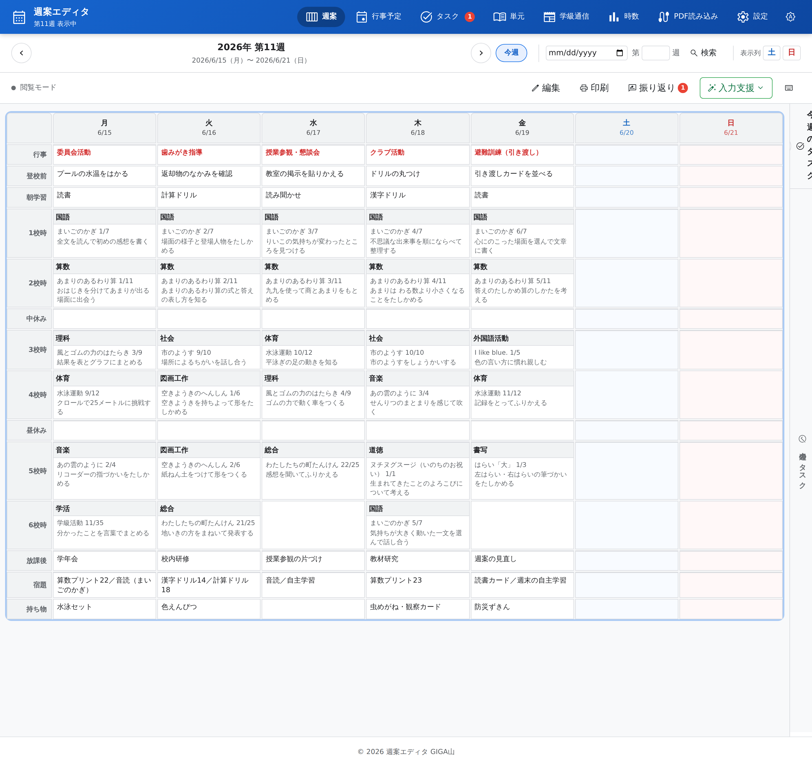

週案の画面。月曜から日曜までを一枚のグリッドで見渡せます。

行の並びは、紙の週案簿とほとんど同じにしてあります。行事、登校前、朝学習、1校時から6校時、中休み、昼休み、放課後、宿題、持ち物の14行です。「登校前」の行は、出勤してから子どもたちが来るまでの間に済ませておきたいことを書いておくための欄で、印刷するときに載せるかどうかを選べます。プールの水温をはかる、返却物のなかみを確かめる、といった、忘れると困るのに書きとめる場所がなかったことを置いておけます。

祝日は自動で赤くなり、名前がバッジで出ます。内閣府が公開している祝日データを取りに行って、月に一度くらいの間隔で自分から更新するので、先生が入力する必要はありません。

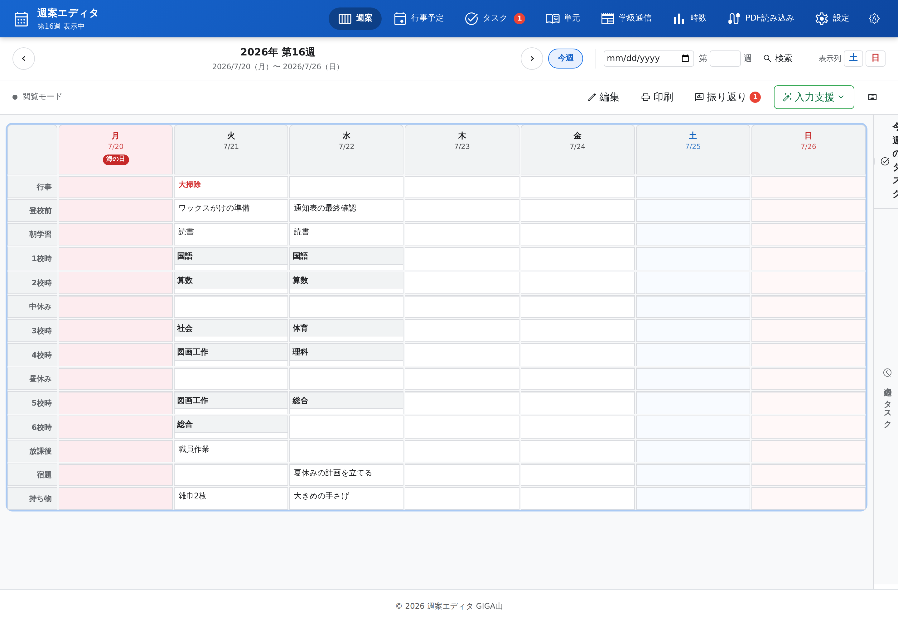

海の日のある7月の週。休みの日が一目で分かるので、時間割の入れかえを考えるときに助かります。

編集ボタンを押すと、セルに直接書き込めます。セルのコピー、貼りつけ、ドラッグでの入れかえ、取り消しといった操作をひととおり用意してあるので、行事で1校時と3校時を入れかえるといった作業が、書き直しではなくつまんで動かすだけで終わります。

編集モード。教科名、単元名、学習内容の三段に分かれています。

もうひとつ、地味ですが効く機能があります。すべての週をまたいだ検索です。「あの避難訓練っていつだったっけ」「実験をやったのは何月だった」というとき、行事も学習内容も宿題も振り返りも、まとめて言葉で探せます。結果をクリックすればその週へ飛びます。

キーワードで、すべての週の入力内容を横断して探します。

書けたら印刷です。このアプリを作った理由が、そのままここにあります。

レイアウトはA4二枚と、一枚に収めるコンパクトの二種類。行事、登校前、朝学習、中休み、昼休み、放課後、教科時数表、週のまとめ、Todoリストの9項目から、その週に載せたいものを選びます。文字の大きさは8ptから14ptまで、つまみを動かして決めます。土曜授業のある週は、週案の画面で土曜の列を出しておけば、コンパクトの印刷にもその列が出ます。前回選んだ設定は覚えているので、毎週えらび直す必要はありません。

印刷の前に、レイアウトと載せる項目を選びます。

そのうえで、行が増えて一枚に収まらなくなったときは、ページごと自動で縮めます。印刷に出す直前に中身の高さと紙の高さを比べて、はみ出したぶんだけ全体を小さくする。Excel でセルの中の文字が縮んで表示されるのと同じことを、ページまるごとでやっています。学習内容を長く書いた週でも、下のほうが次の紙に流れていくことはありません。

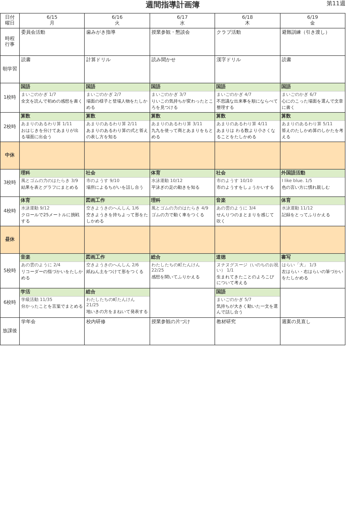

1ページ目。学習内容まで入った週案簿の形で出ます。

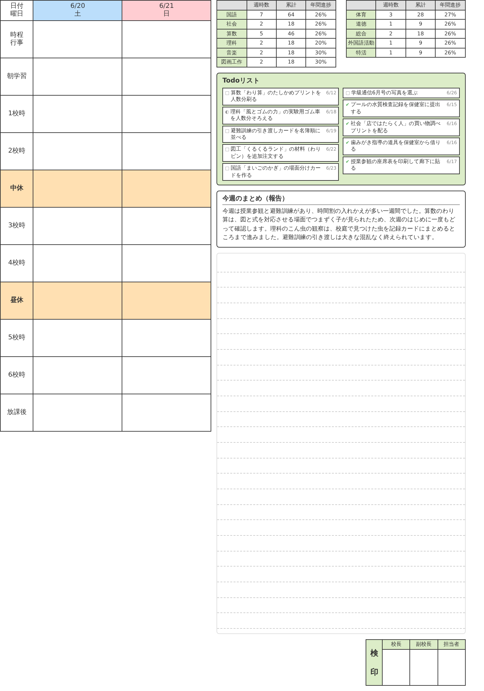

2ページ目。教科ごとの時数表、Todoリスト、週のまとめ、検印欄まで一枚に収まります。

放課後には、その日の振り返りを書く画面を用意しました。15時をすぎてアプリを開くと、今日の振り返りモードが自分から立ち上がります。聞かれるのは4つだけです。予定との変更点、成果、課題、特記事項。ひとつずつ答えていくと、日報の形になって週案の振り返り欄に入ります。

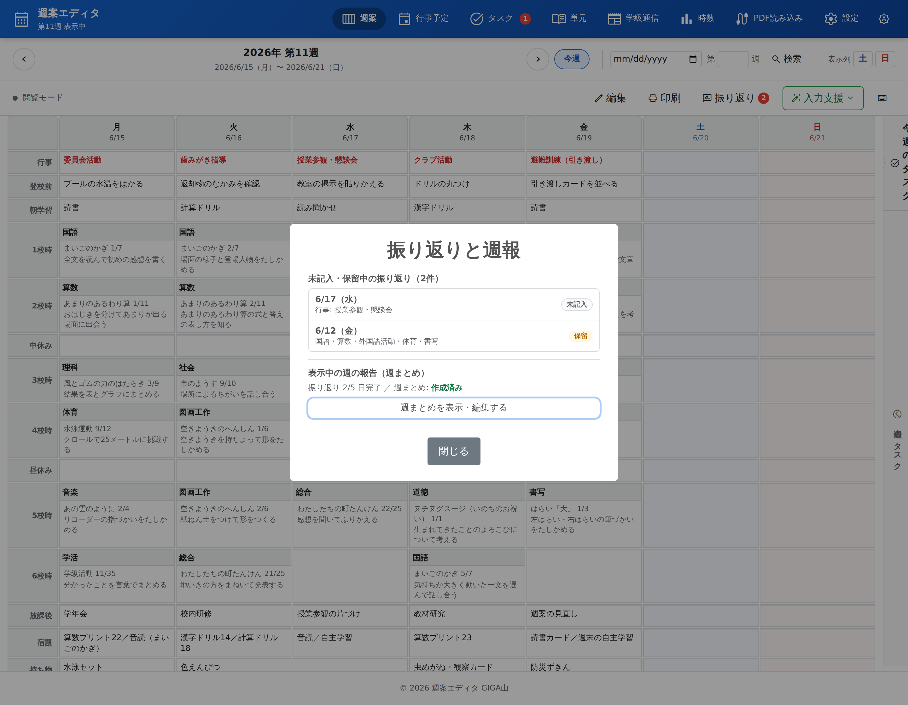

まだ書けていない日と、あとで書くことにした日が一覧になります。

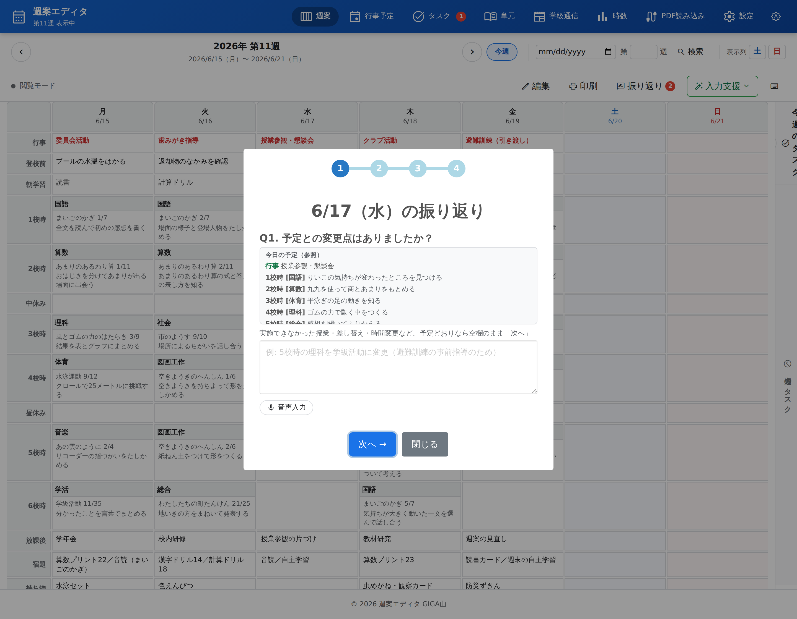

その日の予定を見ながら答えていきます。入力欄には音声入力のボタンが付いているので、教室を片づけながらでも書けます。

その週の授業がある日の振り返りがすべて終わると、一週間ぶんの報告文が自動で作られて、日曜の振り返り欄に入ります。印刷すると、時数表と検印欄のあいだのフリースペースに出てきます。管理職に出す「週のまとめ」を、あらためて書き起こさなくてよくなります。

準備物やタスクは専用のタブにまとめてあります。週案に入っている予定から、準備が必要そうなものをAIが洗い出してくれます。優先度は高、中、低の三段階、進み具合は未着手、進行中、完了の三段階。期限が過ぎたものと今日が期日のものは、タブのバッジと画面の上に出るので、忘れたまま当日を迎えることが減るのではないかと思います。毎朝のメールで、その日に必要なタスクを知らせる設定もあります。

上がAIによる洗い出し、下が現在のタスク一覧、いちばん下が毎朝のメール通知の設定です。

学級通信は、ブロックを並べていく形のエディタです。見出し、テキスト、画像、段組み、ギャラリー、時間割、QRコード、区切り線、ワードアートの9種類を組み合わせて作ります。「予定を読込」を押すと、その週の週案がそのまま時間割の表として入ります。来週の予定を通信に載せるために、もう一度打ち直す必要はありません。

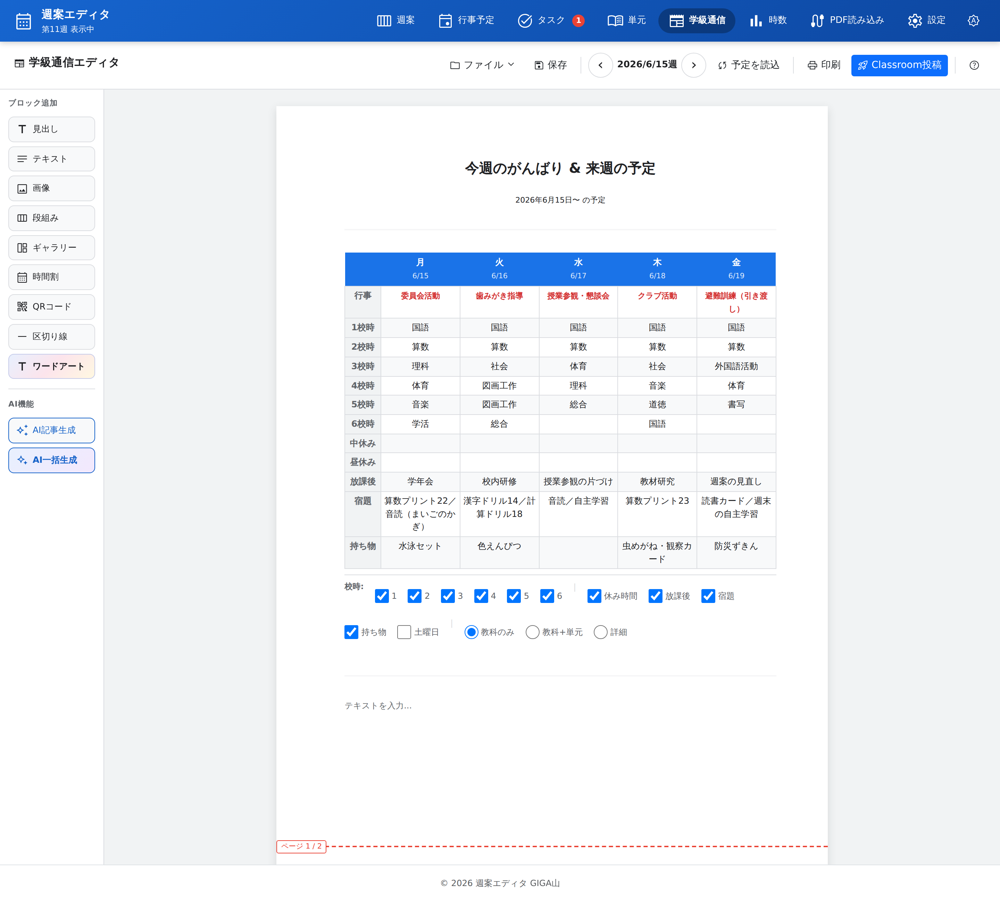

週案から取り込んだ時間割。載せる校時や、教科だけにするか単元まで出すかも選べます。

学校で配られる年間行事予定のPDFは、アプリの中でそのまま開けます。学校ごとのフォルダに分けて置けるので、複数校を受け持っている先生も混ざらずに済みます。

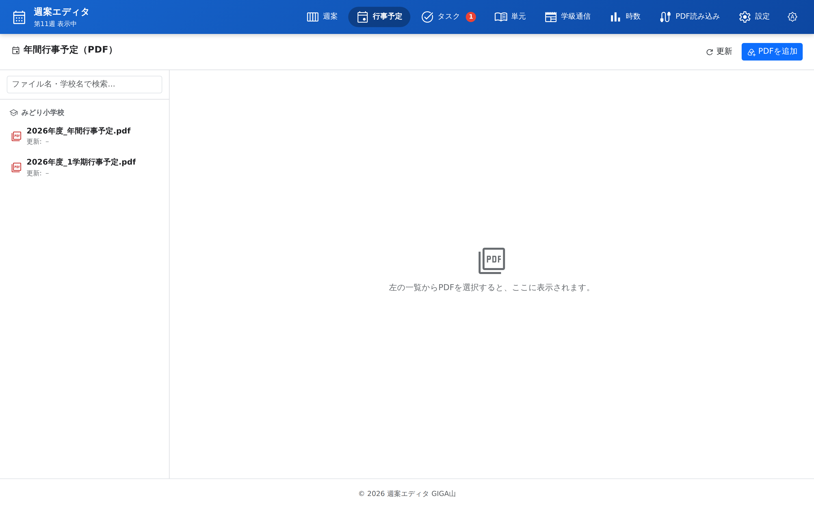

学校ごとにまとめた年間行事予定を、アプリを離れずに確認できます。

指導計画や行事予定のPDFを読み込ませて、単元マスタや行事の欄に流し込むこともできます。ドラッグして置くだけで解析がはじまり、結果は必ずプレビューで見せてから反映します。AIが読みちがえたところは、その場で直したり、外したりできます。読んだものがそのまま書き込まれることはありません。

指導計画のPDFと行事予定のPDFを、それぞれ別の入り口から読み込みます。

## 🗓 手が止まるのは「単元」と「学習内容」のところ

週案を書いていて、いちばん手が止まるのはどこでしょうか。教科名を埋めるのは固定時間割どおりなので、そう時間はかかりません。時間を取られるのは、そのとなりの「単元名」と「学習内容」です。

前の週の週案を開いて、算数がどこまで進んだかを確かめる。教科書を開いて、次の時間の学習活動を読む。それを週案の欄に書き写す。教科の数だけこれをくり返すと、あっという間に時間が過ぎます。

そこで、このアプリには年間指導計画を「単元マスタ」という形で持たせてあります。1行が単元の1時間ぶんで、そこに学習活動が書いてあります。一度入れておけば、以降はここから引き当てるだけになります。

単元マスタ。教科、単元名、総時数、何時間目か、学習活動の並びです。

この単元マスタと、これまでに入力した週案を突き合わせると、単元ごとの進み具合が分かります。週案の単元欄を開いたとき、その教科の単元が「未指導」「何時間目まで実施済み」「指導済み」に分かれて出てくるのは、そのためです。次に指導する単元は先頭に置かれ、終わった単元は畳まれて下に送られます。一覧から目で探す必要がありません。

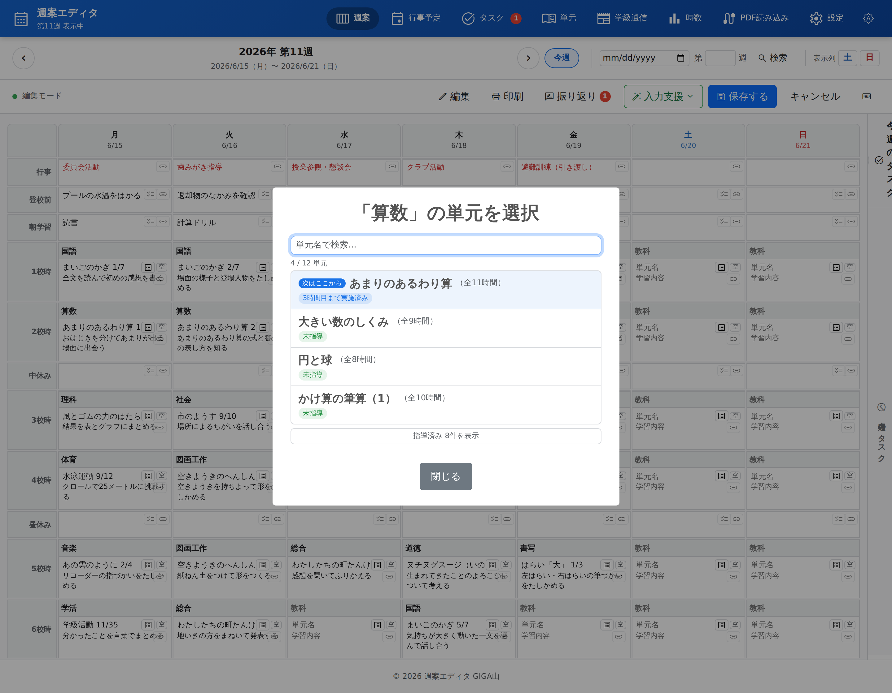

「次はここから」と示された単元が先頭に来ます。指導済みの8件は畳まれています。

単元を選ぶと、何時間目かも自動で次の時間が選ばれ、その時間の学習活動が学習内容の欄に入ります。教科書を開き直す手間がなくなります。

まとめて入れたいときは、編集の画面から入力支援のメニューを開きます。固定時間割をこの週に写す、単元をこの週に自動で割り当てる、この週から先をまとめて割り当てる、単元の予定を前後にずらす、の4つです。

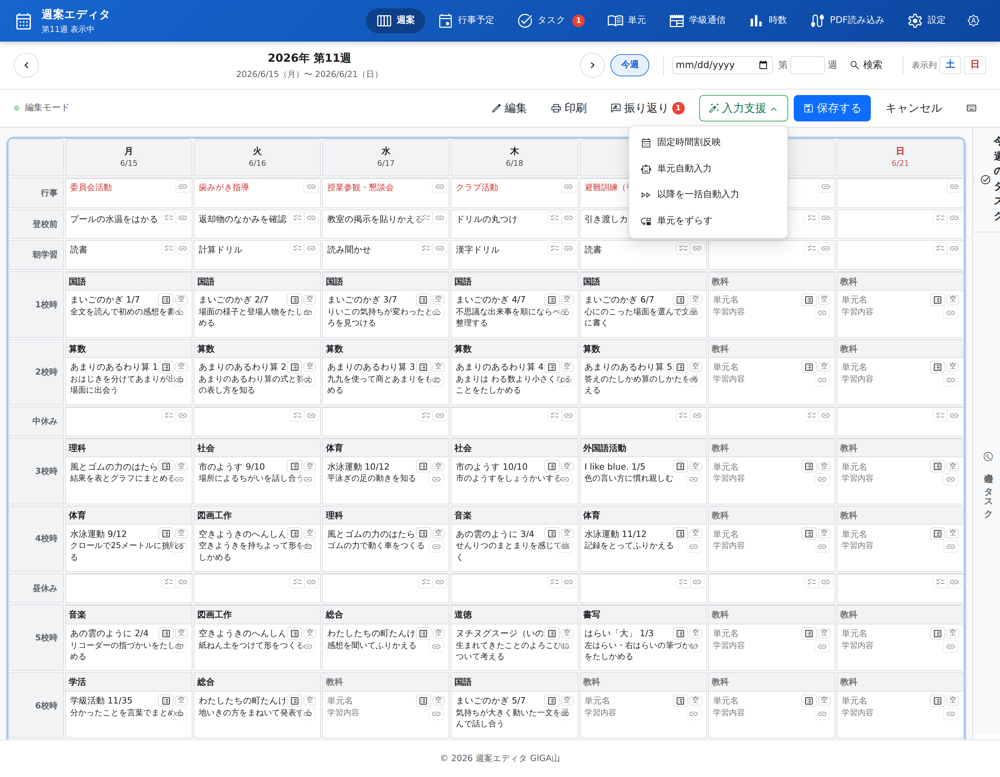

入力支援のメニュー。よく使う一括操作をここにまとめてあります。

年度のはじめに固定時間割を一年ぶん転記しておけば、先の週は教科名だけが入った状態になります。あとは指導が近づいたところで単元を割り当てていけばよく、白紙から書きはじめることがなくなります。

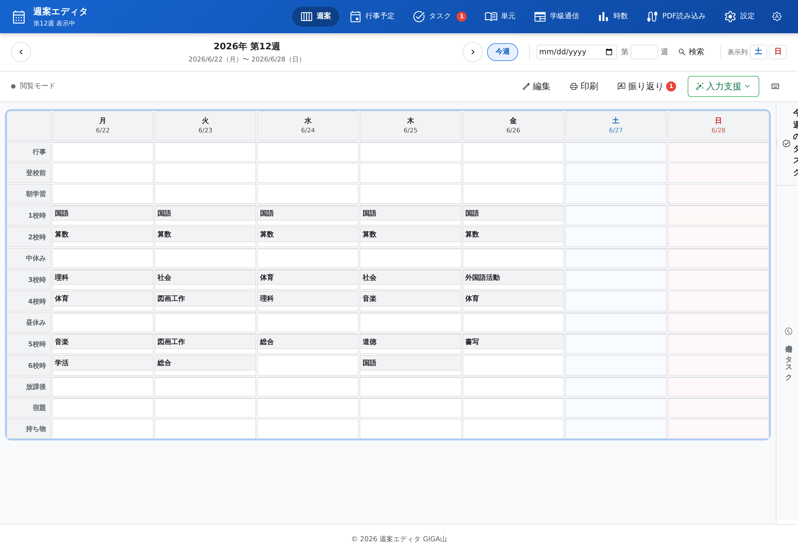

先の週。固定時間割を年間一括で転記すると、教科名だけが先に入った状態になります。

一年も使っていると、単元マスタのほうにズレが溜まります。時数を増やしたのに行を足していない、同じ時間目の行が二つある、途中の時間目が抜けている、といったことです。単元マスタのタブにある整合性チェックを押すと、こうしたズレを7種類に分けて一覧にしてくれます。

見つかったズレと、修復したらどうなるかが並びます。

ここで大事にしたのは、修復しても学習活動の中身を消さないことです。やるのは並べ替えと番号のふり直し、総時数の合わせ直し、足りない行の追加だけ。しかも、週案ですでに指導済みになっている時数を下回らないように調整します。実行する前の状態は復元ポイントとして保存されるので、思っていたのと違ったら戻せます。この修復にAIは使っていません。数え直せば分かることに、わざわざ判断の余地を持ち込む必要はないと考えたからです。

## 📊 時数の不安を、年度末まで先回りする

もうひとつ、学期末や年度末に気が重くなるのが時数です。「理科、足りているだろうか」と思いながら、電卓を出して数える。あの時間をどうにかしたいと思っていました。

週案に入力した教科名を集計すれば、教科ごとの実施時数は自動で出ます。月別、学期別、年間の合計まで一枚の表になります。

教科ごと、月ごとの実施時数。学期の区切りと合計まで自動で出ます。

そのうえで、年度末にどうなりそうかを予測します。今日までに実施した時数と、明日から先に入力してある予定の時数を足して、年間の標準時数と比べるだけの単純な計算です。それでも、足りない教科の名前がはっきり出るのは大きいと思います。

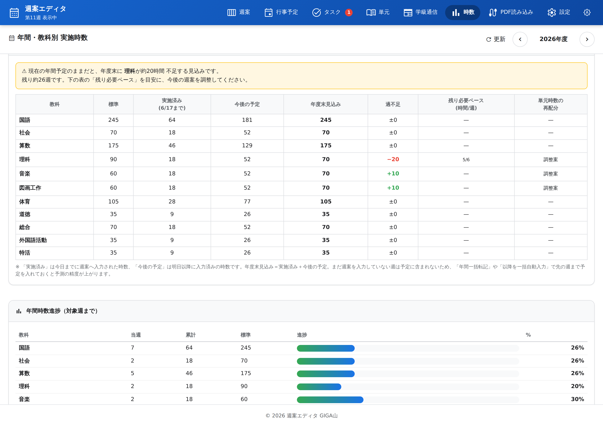

不足が見込まれる教科と、「残り必要ペース」が出ます。

この画面の例では、理科が20時間ほど足りず、音楽と図画工作が10時間ずつ余る見込みになっています。固定時間割を均等に割ると、こういうことが起きます。それを2月に気づくのと、6月に気づくのとでは、打てる手がまったく変わってきます。

過不足のある教科には「調整案」というボタンが出ます。押すと、標準時数に近づくように、まだ指導していない単元へ時数を配り直す案を作ります。ここでAIを使ってはいますが、使い方には気をつけました。まず機械的に比例配分した案をこちらで作り、AIにはその微調整だけを頼んでいます。こうしておけば、AIが使えない環境でも案は必ず出ますし、出てくる数字が突拍子もないものになりません。

単元そのものを組み直すこともできます。単元マスタの魔法のステッキのアイコンから「この単元を8時間に組み直したい」と頼むと、学習活動を新しい時間数に合わせて統合したり分割したりした案が出ます。ここでも、すでに週案に入力済みの時間は変更されません。その部分はAIに渡してさえいません。終わった授業の記録が書きかわってしまったら、道具として信用できないからです。結果は必ずプレビューで確かめてから反映し、反映前の状態は復元ポイントとして残ります。

## ✨ 導入のメリット

三つのいいことが期待できます。

一つ目は、提出する紙の形を自分で決められることです。載せる項目も、文字の大きさも、土日の列を出すかどうかも、その週の都合で選べます。行事の多い週は行事の欄を厚く残す。手書きで振り返りを書きたい週は、週のまとめを空けたまま印刷する。はみ出したぶんは勝手に縮んで一枚に収まるので、行の高さを一つずつ直して余白を調整する、あの作業がなくなります。私がスプレッドシートで越えられなかったのはここでした。

二つ目。書き写す時間と、数える時間が減ります。固定時間割の転記も、単元の何時間目かを数えることも、学習活動を教科書から書き写すことも、アプリの側でやります。教科ごとの実施時数は入力から自動で出て、年度末の見込みまで示されるので、電卓を出して数える必要もありません。先生が考えるのは「この時間をどうするか」だけになります。

三つ目は、その日にあったことが記録として残ることです。放課後の4つの質問に答えるだけで日報ができ、一週間ぶんの報告文まで自動でまとまります。書き残すこと自体が目的ではありません。次の年に同じ単元を教えるとき、去年の自分が残した「ここでつまずいた」という一行が、いちばん役に立つ資料になるはずです。

## 🛠️ 【管理者向け】導入手順

情報担当の先生に確認されそうなことを、先に書いておきます。

まず、子どもの個人情報を扱う設計にはしていません。入力するのは週案、時数、単元、タスク、学級通信で、名簿や成績を持つ場所を用意していません。データは先生ご自身の Google スプレッドシートに保存され、そのファイルは先生のドライブの中にあります。アプリの作者を含め、他の誰かのサーバーに記録が集まることはありません。

ここは、作るときに迷って決めたところでもあります。試しに使ってもらった先生から、子どもの情報を入れておけるページがあると助かる、という声をもらいました。データが先生のドライブから外に出ることはないとはいえ、子どもの情報を1か所にまとめて書く場所は、あえて作りませんでした。そういう欄をひとつ作れば、そこに書けることは全部書く、という使い方が必ず生まれます。この道具が引き受けるのは、先生自身の予定と記録までにしておきたいと思っています。

Google ドライブへのアクセス権は、必要なぶんだけに絞ってあります。アプリが作ったファイルと、先生が画面上で選んだファイルにしか触れません。ドライブ全体を見にいく権限は求めません。

ひとつだけ、外に出ていくものがあります。AIの機能を使うときは、その処理に必要な文章がGoogleの生成AIへ送られます。単元の学習活動を作るときは単元名と時数、タスクを洗い出すときは週案に書いた予定の文章、といった具合です。子どもの名前を書き込む欄はもともと用意していませんが、備考のような自由記述欄に個人が分かることを書かない、という点は先生方に伝えておいてください。AIの機能を使わない運用も選べます。その場合はキーを設定しないだけで、週案づくりと時数の集計はそのまま使えます。

校内のフィルタリングで許可が必要なアドレスは四つあります。アプリ本体が動いているのは script.google.com で、ここが塞がれると何も表示されません。schoolplan-editor.giga-school.com は、アプリとして端末に入れるための入り口です。ブラウザのタブから使うだけなら無くてもかまいません。Google ドライブからファイルを選ぶ画面では apis.google.com を使いますが、塞がれていても、その画面以外はふつうに動きます。generativelanguage.googleapis.com はAIの機能を使うときだけのもので、AIを使わない運用なら要りません。

見た目が崩れることのないよう、レイアウトやアイコンに必要なファイルは、外部の配信元から取りにいかずアプリの中に持たせてあります。学校のネットワークで cdn.jsdelivr.net などが塞がれていても、画面が壊れることはありません。本文の書体だけは Google のフォントを使っていますが、届かなくても字の形が変わるだけです。

インターネットにつながっていないと使えません。圏外や通信が切れているときは、その旨を伝える画面が出るようにしてあります。

共用端末で使う場合は、使い終わったら Google アカウントからログアウトしてください。次に開いた人がそのまま前の人の週案を見られる状態になります。

入れるときの段取りも書いておきます。まず Google スプレッドシートを新しく作り、拡張機能から Apps Script を開きます。公開しているファイルの置き場から中身をすべてコピーして保存してください。アプリの動く条件を書いた設定のファイルも、忘れずに反映してください。つづいてサービスの一覧から Google Classroom と Google ドライブを追加します。Classroom への投稿を使わない場合でも、追加しておくと後で困りません。あとはウェブアプリとして公開の設定をして、発行されたURLを開くだけです。初回は設定ウィザードが立ち上がるので、担当学年、AIのキー、年間カレンダー、Classroom連携の順に、案内どおり進めてください。AIのキーはあとからでも入れられます。

Classroom連携を使うと、翌日の時間割、宿題、持ち物を、決めた時刻にクラスのストリームへ自動で投稿できます。使わない場合は設定しなければ何も起きません。

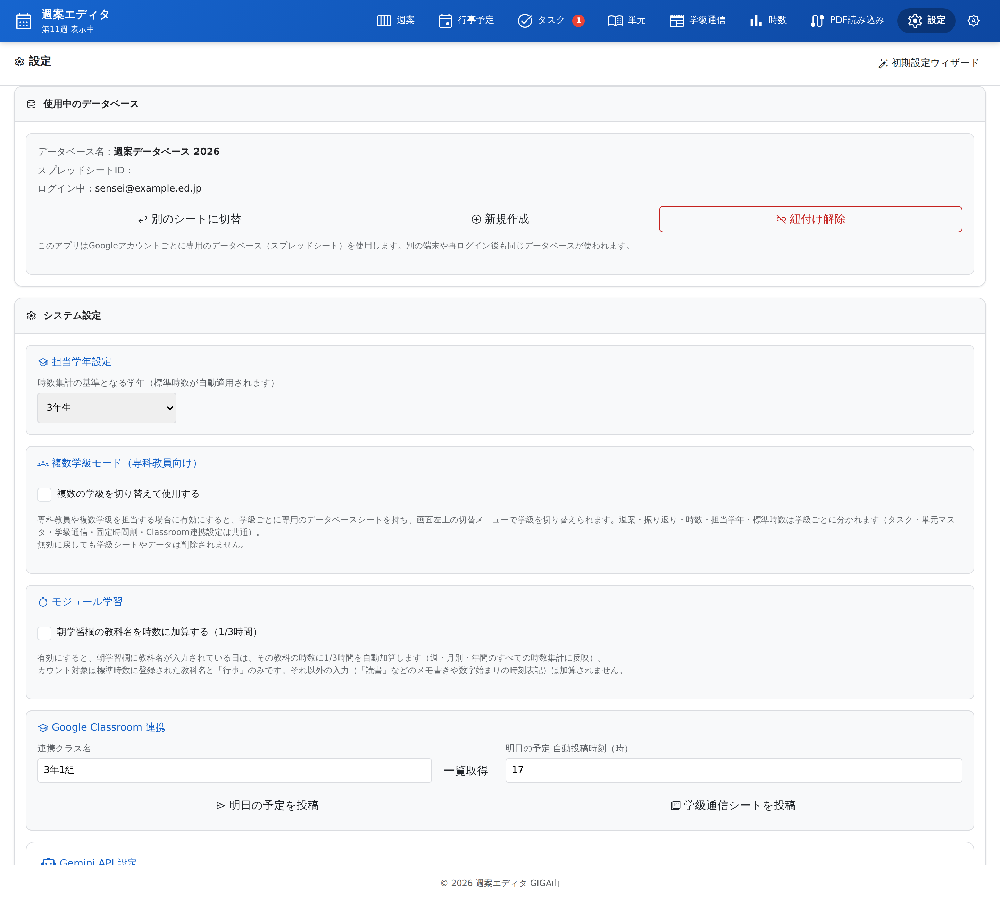

設定の画面。担当学年、複数学級モード、Classroom連携、AIのキーがここに並びます。

専科の先生や複数の学級を受け持つ先生のために、学級ごとにデータを分ける複数学級モードも用意してあります。設定でオンにしたときだけ画面に現れる仕組みで、使わない先生の画面には一切出てきません。週案と時数は学級ごとに分かれ、単元マスタやタスクは全学級で共通になります。

固定時間割は設定の画面で登録します。ここに一度入れておけば、任意の週への転記も、長期休業を除いた年間一括の転記もボタンひとつです。

固定時間割エディタ。ここに入れた内容が、週案への一括転記のもとになります。

データの守り方についても書いておきます。週案を保存する前に復元ポイントが作られ、1日1回の完全バックアップが別のスプレッドシートとしてマイドライブに作られます。バックアップは最新4件、30日を超えたものはドライブのごみ箱へ自動で移ります。消してしまったデータは30日間ごみ箱に残ります。何をいつ変えたかの記録も残ります。

バックアップ、復元ポイント、ごみ箱、監査ログを設定の画面から扱えます。

## 📖 【利用者向け】使い方のガイド

1. 配られたURLをパソコンやタブレットで開き、学校のGoogleアカウントでログインします。
2. 初回は設定ウィザードが開きます。担当学年を選び、年間カレンダーを作るところまで進めてください。ここまで済めば週案が書けるようになります。
3. 設定のタブを開き、固定時間割エディタに毎週の基本の時間割を入れて保存します。
4. その下の年間一括転記で、夏休み、冬休み、春休みの期間を入れて実行します。これで一年ぶんの枠に教科名が入ります。
5. 単元のタブを開き、年間指導計画を単元マスタに入れます。手で入れてもよいですし、PDF読み込みのタブに指導計画のPDFを置いて読ませることもできます。読ませた結果は必ずプレビューで確かめてから反映してください。
6. 週案のタブに戻り、編集を押します。単元名の欄の横にあるボタンから、その教科の単元を選びます。「次はここから」と出ている単元を選べば、何時間目かと学習活動が自動で入ります。
7. 行事、宿題、持ち物を書き足して、保存するを押します。
8. 印刷を押し、レイアウトと載せる項目を選んで印刷します。用紙はA4の縦、色を付けたいときはプレビューの詳細設定で背景のグラフィックにチェックを入れてください。
9. 放課後にアプリを開くと、その日の振り返りが立ち上がります。4つの質問に答えると日報ができます。その場で書けないときは、あとで書くを選んで保留にできます。
10. 学期の途中で時数のタブを開き、年度末シミュレーションを確かめます。不足が出ている教科があれば、調整案から時数の配り直しを検討します。

アプリとして端末に入れておくと、タブから探す手間がなくなります。ChromeやEdgeなら画面左下の丸いボタンからインストールを選び、iPadやiPhoneなら共有ボタンからホーム画面に追加を選んでください。

## 📝 まとめ

このアプリで減らそうとしたのは、書き写す時間と、数える時間、そして印刷の形を整える時間です。どれも、やらないと困るのに、やったところで授業がよくなるわけではない仕事でした。そこを機械に渡してしまえば、そのぶん教材を考える時間や、子どもと話す時間にまわせるのではないか。そう思って作りました。

正直に書いておくと、いまでもスプレッドシートのほうが良かったと感じるところはあります。いちばんは保存です。スプレッドシートは、セルに書いた時点でもう残っています。書いたものが消えていた、知らないうちに上書きされていた、ということが起きません。こちらのアプリは、編集して保存を押すまでシートに書き込まれない作りです。タブや週を移るときには自動で保存し、保存しないまま閉じようとすれば警告を出すようにしましたが、何も考えなくていい安心には、まだ届いていないと思います。ここは直したいところとして残っています。

効率化そのものが目的ではありません。週案を早く書き終えることに意味があるのではなく、早く書き終えたあとに何をするかに意味があるのだと思います。放課後に職員室で週案と格闘するかわりに、明日の理科の実験をもう一度自分で試してみる。その入れかえができたら、と願っています。

紙の週案が手に合っている先生に、無理にこちらへ移ってほしいとは思っていません。ただ、デジタルの週案を一度あきらめた理由が、提出する紙の見た目だったのなら、このアプリはその一点のために作られたものです。学校ごとに週案の様式は違いますし、書き方の作法も違います。使いにくいところがあれば教えてください。届いた声のぶんだけ、道具は現場に近づいていきます。

一歩踏み出そうとする先生を、私はいつでも全力で応援しています。

## 🏷 ハッシュタグ

#小学校 #小学校教員 #教育 #授業づくり #学級経営 #GIGAスクール #ICT教育 #1人1台端末 #校務DX #働き方改革 #週案 #Chromebook #タブレット学習 #個別最適な学び #週案エディタ
